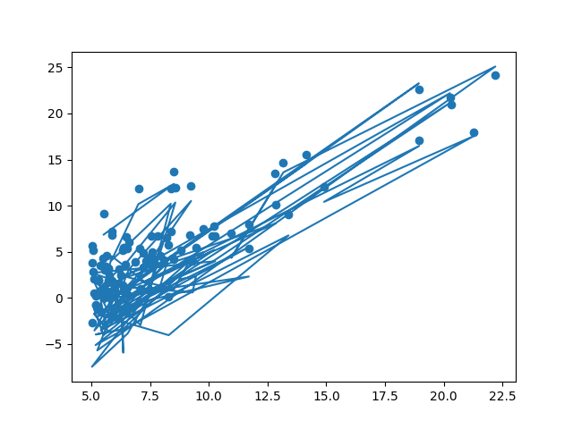

# Error Calculation

In this project, I just calculated error of the dataset and prediction, using `mean_squared_error` function. That was easy to do, and had a lot of fun and learning for me. 

And after all, I visualized my dataset like this: 

